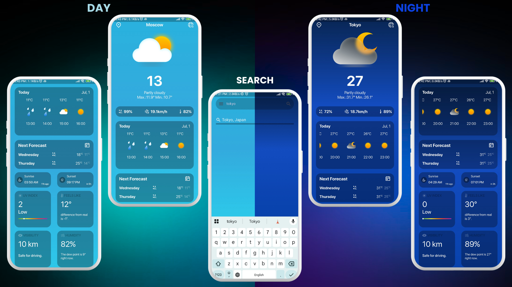
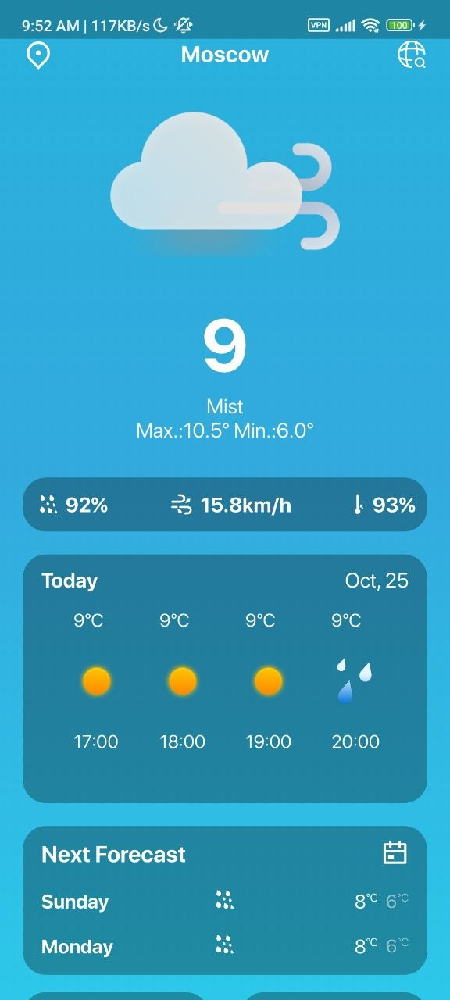
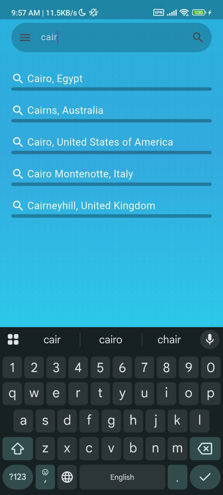
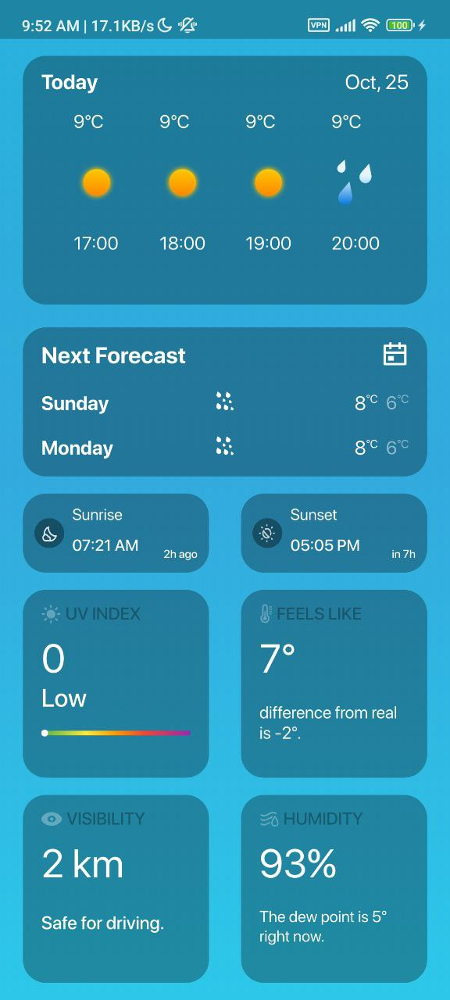
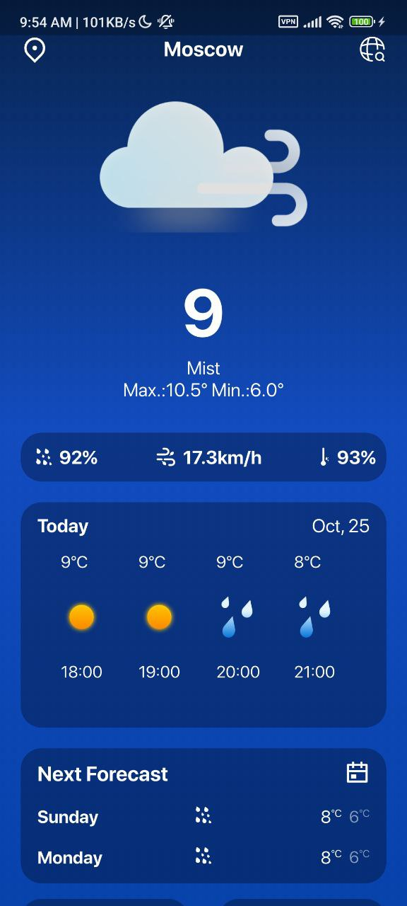
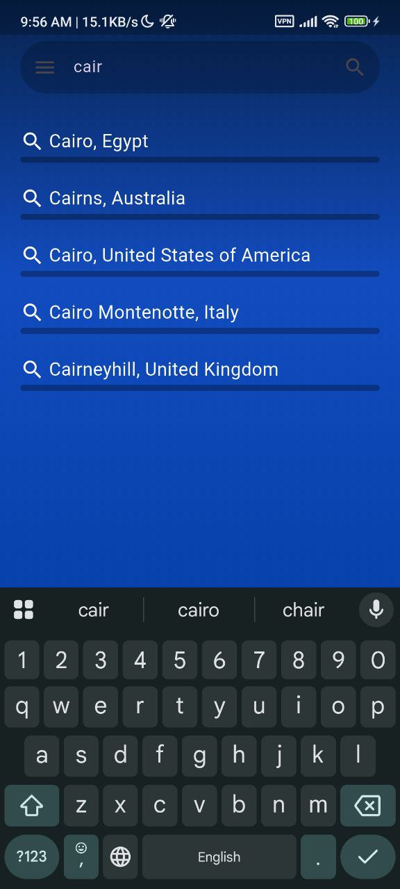
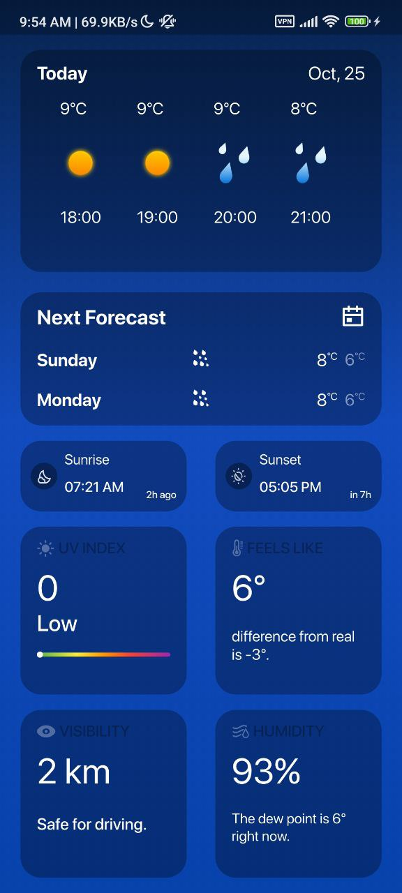

# 🌤️ Atmos - Weather App

A beautiful and feature-rich Flutter weather application that provides real-time weather information, forecasts, and detailed meteorological data using the WeatherAPI service.

<div align="center">
  
</div>

## 📋 Overview

Atmos is a Flutter-based weather application that delivers an intuitive and visually appealing interface for checking weather conditions. It automatically detects your location and provides comprehensive weather information, including current conditions, hourly forecasts, 3-day predictions, and essential weather metrics like UV index, humidity, and visibility.

## ✨ Features

- 🌍 **Automatic Location Detection** - Uses GPS to fetch weather for your current location
- 🔍 **City Search** - Search and save any city worldwide
- 🌡️ **Current Weather** - Real-time temperature, conditions, and "feels like" temperature
- ⏰ **Hourly Forecast** - 24-hour detailed weather predictions
- 📅 **3-Day Forecast** - Extended weather outlook with max/min temperatures
- 🌅 **Sunrise & Sunset Times** - Accurate astronomical data with countdown timers
- ☀️ **UV Index** - Visual indicator with safety recommendations
- 💧 **Humidity & Visibility** - Detailed atmospheric conditions
- 🌙 **Day/Night Themes** - Dynamic UI that adapts to day or night conditions
- 🔄 **Pull-to-Refresh** - Easy data updates with swipe gesture
- 🎨 **Beautiful UI** - Modern gradient designs with smooth animations

## 🛠️ Tech Stack

### Core Technologies
- **Flutter** - Cross-platform mobile framework
- **Dart** - Programming language

### State Management
- **flutter_bloc** - Business Logic Component pattern for predictable state management
- **Cubit** - Simplified state management for search functionality

### Networking
- **Dio** - Powerful HTTP client for API requests
- **WeatherAPI** - Weather data provider

### Location Services
- **Geolocator** - GPS location detection and permissions handling

### Local Storage
- **SharedPreferences** - Persistent key-value storage for saved cities

### UI Components
- **flutter_svg** - SVG rendering for scalable icons
- **intl** - Internationalization and date formatting

## 🏗️ Architecture

The project follows a clean architecture pattern with clear separation of concerns:

```
lib/
├── app/
│   ├── functions/          # Utility functions
│   │   ├── get_condation_icon.dart
│   │   ├── get_time_dif.dart
│   │   ├── num_to_month.dart
│   │   └── save_load_city.dart
│   └── location_handler.dart
├── data/
│   ├── models/             # Data models
│   │   ├── city_model.dart
│   │   └── models.dart
│   └── network/            # API layer
│       ├── app_end_point.dart
│       ├── get_search_data.dart
│       └── get_weather_data.dart
├── ui/
│   ├── bloc/               # State management
│   │   ├── app_state.dart
│   │   ├── search_cubit.dart
│   │   └── weather_bloc.dart
│   ├── widgets/            # Reusable UI components
│   │   ├── current_state_widget.dart
│   │   ├── day_widget.dart
│   │   ├── hour_widget.dart
│   │   ├── mini_statu.dart
│   │   ├── search_reselt_widget.dart
│   │   ├── singel_statu.dart
│   │   ├── status_widget.dart
│   │   ├── today_widget.dart
│   │   └── week_widget.dart
│   ├── home_page.dart
│   └── search_page.dart
└── main.dart
```

### Architecture Layers

**Presentation Layer (UI)**
- Widgets for displaying weather information
- BLoC/Cubit for state management
- Responsive design with custom components

**Domain Layer (App)**
- Business logic and utility functions
- Location handling
- Data persistence

**Data Layer**
- Models for data representation
- Network services for API communication
- Repository pattern for data access

## 🚀 Getting Started

### Prerequisites

- Flutter SDK (3.0.0 or higher)
- Dart SDK (3.0.0 or higher)
- Android Studio / VS Code with Flutter extensions
- WeatherAPI key (get one from [WeatherAPI.com](https://www.weatherapi.com/))

### Installation

1. **Clone the repository**
   ```bash
   git clone https://github.com/yourusername/weather_app.git
   cd weather_app
   ```

2. **Install dependencies**
   ```bash
   flutter pub get
   ```

3. **Add your API key**
   
   Open `lib/data/network/app_end_point.dart` and replace the API key:
   ```dart
   static String apiKey = "YOUR_API_KEY_HERE";
   ```

4. **Add assets**
   
   Ensure your `pubspec.yaml` includes the assets folder:
   ```yaml
   assets:
     - assets/icons/
   ```

5. **Run the app**
   ```bash
   flutter run
   ```

### Platform-Specific Setup

**Android**
- Minimum SDK version: 21
- Add location permissions in `AndroidManifest.xml`

**iOS**
- iOS version: 12.0+
- Add location permissions in `Info.plist`

## 📸 Screenshots

_Coming soon! Add your app screenshots here._


| Home Screen | Search | Forecast |
|------------|--------|----------|
|  |  |  |
|  |  |  |

## 📞 Contact & Social Links

- **GitHub**: [@Yousef-Sh3ban](https://github.com/Yousef-Sh3ban)
- **LinkedIn**: [yousef-sh3ban](https://linkedin.com/in/yousef-sh3ban)
- **Email**: yousefshaban1551@gmail.com

---

<div align="center">

**⭐ If you found this project helpful, please consider giving it a star!**

Made with ❤️ using Flutter

</div>
